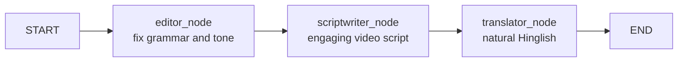
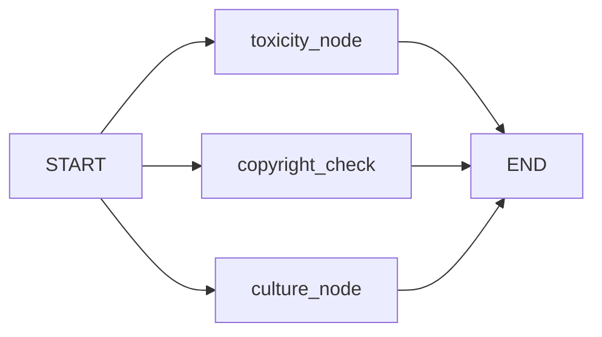
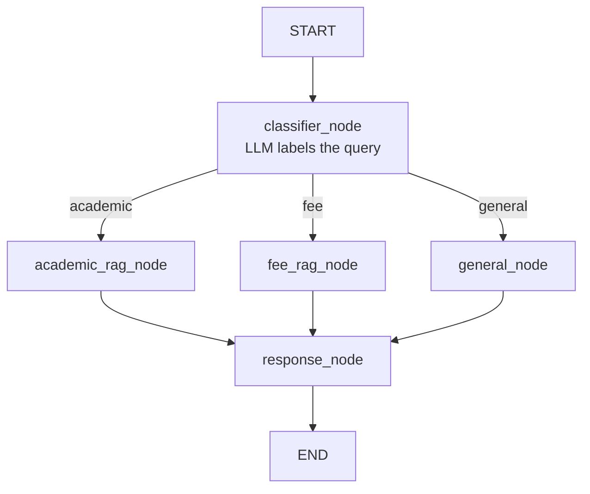
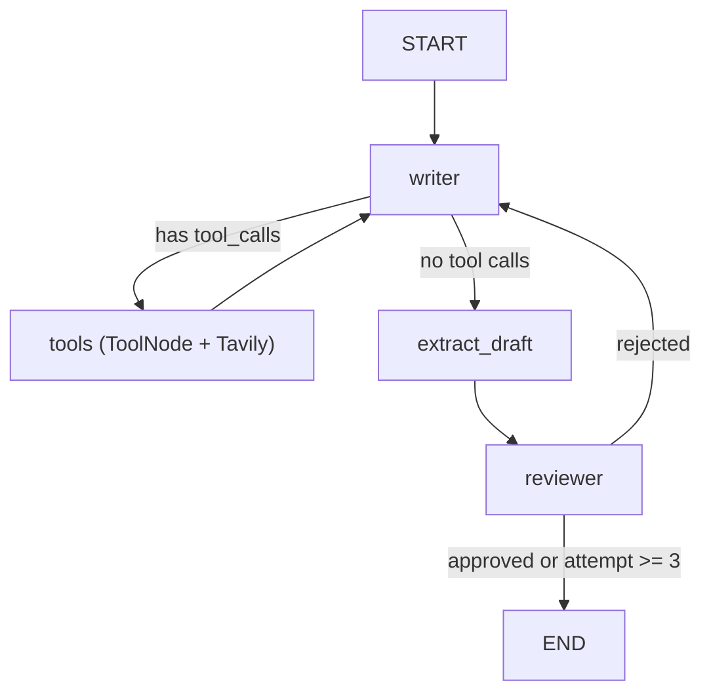
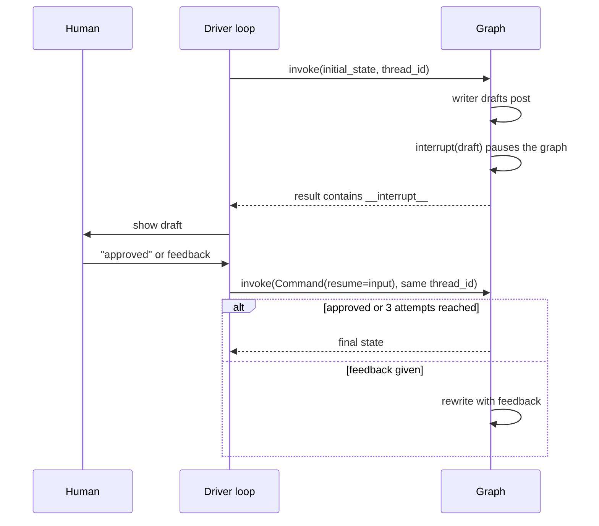

# LangGraph Workflows: From Sequential Pipelines to Human-in-the-Loop Agents

A hands-on collection of **five LangGraph workflow patterns**, each built as a small, runnable project. Together they cover the core ideas of agentic AI: shared state, reducers, routing, RAG, tool calling, loops, and human approval.


---

## Table of Contents

- [Overview](#overview)
- [Projects at a Glance](#projects-at-a-glance)
- [Project Structure](#project-structure)
- [Setup](#setup)
- [Running the Projects](#running-the-projects)
- [Workflow Details](#workflow-details)
  - [1. Sequential: Content Pipeline](#1-sequential-content-pipeline)
  - [2. Parallel: Brand Safety Analyzer](#2-parallel-brand-safety-analyzer)
  - [3. Conditional: College Assistant (RAG)](#3-conditional-college-assistant-rag)
  - [4. Iterative: LinkedIn Post Agent](#4-iterative-linkedin-post-agent)
  - [5. Human-in-the-Loop: Approve or Rewrite](#5-human-in-the-loop-approve-or-rewrite)
- [State Schemas](#state-schemas)
- [Concepts Covered](#concepts-covered)
- [Known Limitations](#known-limitations)
- [Acknowledgements](#acknowledgements)

---

## Overview

**Generative AI** answers a prompt. **Agentic AI** pursues a goal: it uses tools, keeps state, makes decisions, loops, and can pause for a human. LangGraph models this as a **graph**:

| Building block | Role |
|---|---|
| **State** | Shared memory that flows through the whole graph |
| **Nodes** | Python functions that read state and return partial updates |
| **Edges** | Control flow: normal, conditional, parallel, or cyclic |

Every project in this repo is built from those three pieces, adding one new concept each time.

---

## Projects at a Glance

| # | Workflow | File | LLM | What it builds | New concepts |
|---|---|---|---|---|---|
| 1 | Sequential | `sequential_base.py` | Groq (Llama 3.3 70B) | Raw text → edited → video script → Hinglish | State, nodes, edges, compile/invoke |
| 2 | Parallel | `parallel_reducers.py` | Groq (Llama 3.3 70B) | Content moderation scoring (toxicity, copyright, cultural risk) | Fan-out/fan-in, **reducers** |
| 3 | Conditional | `conditional_RAG.py`, `app.py` | Groq (Llama 3.3 70B) | College chatbot routing between two PDF knowledge bases | Router functions, conditional edges, RAG, `add_messages` |
| 4 | Iterative | `iterative_tools.py` | OpenAI (writer) + Groq (reviewer) | LinkedIn post writer with web search and an AI reviewer | Cycles, `ToolNode`, ReAct loop, stop conditions |
| 5 | Human-in-the-Loop | `humanintheloop.py` | OpenAI (GPT-4o-mini) | LinkedIn post drafts approved or revised by a human | `interrupt()`, `Command(resume=...)`, checkpointer |

Bonus: `states.py` demonstrates four ways to define graph state.

---

## Project Structure

```
.
├── sequential_base.py      # Workflow 1: linear pipeline
├── parallel_reducers.py    # Workflow 2: parallel branches + custom reducer
├── conditional_RAG.py      # Workflow 3: CLI college assistant (conditional routing + RAG)
├── app.py                  # Workflow 3: same assistant with a Streamlit UI
├── iterative_tools.py      # Workflow 4: loops + Tavily web search + AI reviewer
├── humanintheloop.py       # Workflow 5: interrupt/resume with a human reviewer
├── states.py               # State schema options (TypedDict, Pydantic, dataclass, MessagesState)
├── requirements.txt
├── academics_handbook.pdf  # (you provide) knowledge base for the academic route
├── fee_structure.pdf       # (you provide) knowledge base for the fee route
└── .env                    # (you create) API keys
```

---

## Setup

### 1. Clone and create a virtual environment

```bash
git clone https://github.com/<your-username>/<your-repo>.git
cd <your-repo>

python -m venv venv
source venv/bin/activate        # Windows: venv\Scripts\activate
```

### 2. Install dependencies

```bash
pip install -r requirements.txt
```

The projects also import a few packages that you should make sure are in `requirements.txt`:

```text
langgraph
langchain
langchain-groq
langchain-openai        # workflows 4 and 5
langchain-tavily        # workflow 4 (web search)
langchain-community
langchain-text-splitters
langchain-huggingface
sentence-transformers
faiss-cpu
pypdf
python-dotenv
streamlit               # Streamlit UI for workflow 3
pydantic                # states.py
```

### 3. Configure API keys

Create a `.env` file in the project root:

```env
GROQ_API_KEY=your_groq_key
OPENAI_API_KEY=your_openai_key
TAVILY_API_KEY=your_tavily_key
```

| Key | Needed by | Where to get it |
|---|---|---|
| `GROQ_API_KEY` | Workflows 1, 2, 3, 4 | [console.groq.com](https://console.groq.com) |
| `OPENAI_API_KEY` | Workflows 4, 5 | [platform.openai.com](https://platform.openai.com) |
| `TAVILY_API_KEY` | Workflow 4 | [tavily.com](https://tavily.com) |

> Never commit `.env`. Add it to `.gitignore`.

### 4. Add your PDFs (workflow 3 only)

Place two PDFs in the project root:

- `academics_handbook.pdf`
- `fee_structure.pdf`

---

## Running the Projects

```bash
# 1. Sequential content pipeline
python sequential_base.py

# 2. Parallel brand-safety analyzer
python parallel_reducers.py

# 3a. College assistant (terminal)
python conditional_RAG.py

# 3b. College assistant (Streamlit web UI)
streamlit run app.py

# 4. Iterative LinkedIn agent (search + AI reviewer)
python iterative_tools.py

# 5. Human-in-the-loop LinkedIn agent
python humanintheloop.py
```

---

## Workflow Details

### 1. Sequential: Content Pipeline

A linear assembly line: each node consumes the previous node's output through shared state.



- **State:** `raw_input`, `edited_text`, `script_text`, `final_output`
- Each node writes exactly one new key, so no reducer is needed.

### 2. Parallel: Brand Safety Analyzer

One input text fans out to three specialist LLM checks that run **concurrently**. Each returns a 0-100 risk score.



- **Key idea, reducers:** all three nodes write to `safety_scores`. Without a reducer, concurrent writes to one key raise an error. A custom reducer merges them:

```python
def merge_score_dicts(existing: dict, newupdate: dict) -> dict:
    if existing is None:
        return newupdate
    return {**existing, **newupdate}

class AnalyzerState(TypedDict):
    raw_text: str
    safety_scores: Annotated[dict[str, int], merge_score_dicts]
```

- **Output example:** `{"toxicity_level": 85, "copyright_risk": 90, "cultural_insensitivity": 20}`

### 3. Conditional: College Assistant (RAG)

A student picks a programme (BCA, BBA, or B.Com (H)). An LLM classifier labels each question, and a router sends it down one of three paths, all converging on one response node.



**RAG pipeline (per PDF):** `PyPDFLoader` → `RecursiveCharacterTextSplitter` (800 chars, 100 overlap) → `all-MiniLM-L6-v2` embeddings → `FAISS` → top-4 retrieval.

| Route | Source of truth |
|---|---|
| `academic` | `academics_handbook.pdf` |
| `fee` | `fee_structure.pdf` |
| `general` | The LLM's own knowledge |

Two interfaces are included:

| | `conditional_RAG.py` | `app.py` |
|---|---|---|
| Interface | Terminal | Streamlit chat UI |
| Programme selection | Numbered menu | Sidebar dropdown |
| Caching | n/a | `@st.cache_resource` for embeddings, retrievers and graph |
| Chat history | Not kept between turns | Kept in `st.session_state` |
| Extras | | Coloured route badge (ACADEMIC / FEE / GENERAL), Clear Chat button |

### 4. Iterative: LinkedIn Post Agent

An agent that researches a topic, drafts a LinkedIn post, and has a **separate reviewer LLM** critique it. The graph contains **two loops**:

1. **Tool loop (ReAct style):** writer ↔ tools. The writer decides when to search the web with Tavily.
2. **Quality loop:** reviewer → writer. Rejected drafts go back with feedback.



- **Stop conditions:** approval, or a maximum of 3 attempts. LangGraph's `recursion_limit` acts as a hard safety cap.
- **Two models, two temperatures:** creative writer (GPT-4o-mini, 0.7) and strict reviewer (Llama 3.3 70B, 0.2).

### 5. Human-in-the-Loop: Approve or Rewrite

Same writer/review loop, but the reviewer is **you**. The graph pauses at the review node and waits for input.



- `interrupt(payload)` pauses execution and hands `payload` to your code.
- `Command(resume=value)` resumes; `value` becomes the return value of `interrupt()`.
- A **checkpointer** (`MemorySaver`) plus a **`thread_id`** are required so the graph can save and restore its state.
- Type `approved` (or `approve`, `yes`, `ok`, `good`) to accept. Anything else is treated as feedback.

---

## State Schemas

`states.py` shows four ways to define state in LangGraph:

| Approach | Best for |
|---|---|
| `TypedDict` | Default choice: lightweight, works with reducers via `Annotated` |
| Pydantic `BaseModel` | Runtime validation of inputs |
| `@dataclass` | Rarely used; plain Python defaults |
| `MessagesState` | Chat apps: `messages` with the `add_messages` reducer built in |

---

## Concepts Covered

- **State, nodes, edges**, `START`/`END`, `compile()`, `invoke()`
- **Sequential, parallel, conditional, and iterative** graph topologies
- **Fan-out / fan-in** and **reducers** (custom dict merge, `add_messages`)
- **Router functions** and `add_conditional_edges` (rule-based and LLM-based)
- **RAG inside a graph**: chunking, embeddings, FAISS, retrieval as a graph branch
- **Tool calling**: `bind_tools`, `ToolNode`, ReAct-style loops
- **Reflection pattern**: generator LLM plus critic LLM
- **Loop control**: attempt counters and `recursion_limit`
- **Persistence and HITL**: checkpointers, `thread_id`, `interrupt()`, `Command(resume=...)`

---

## Known Limitations

Honest notes on where this code can be improved:

- **Parallel analyzer:** if the LLM returns a non-integer, the score defaults to `0` (which reads as "safe"). A safer design would retry or use structured output. There is also no aggregator node after the fan-out.
- **College assistant:** chat history is stored, but the classifier and response prompts only use the latest message, so follow-up questions lose context. The RAG prompt could also instruct the model to say "I don't know" when the context has no answer.
- **Iterative agent:** make sure the tools node routes **back to the writer** (`graph.add_edge("tools", "writer")`) so the model can read search results before drafting. The reviewer's approval parsing is string-based and could be replaced with structured output.
- **Human-in-the-loop:** `MemorySaver` is in-memory only. Use a durable checkpointer (SQLite or Postgres) for production. Code before `interrupt()` in a node re-runs on resume, so avoid side effects there.
- LLM outputs are non-deterministic; results will vary between runs.

---

## Acknowledgements

- Built while following the **Agentic AI / LangGraph** course material by [Sheryians Coding School](https://slides.com/sheryianscodingschool/bento).
- Powered by [LangGraph](https://github.com/langchain-ai/langgraph), [LangChain](https://github.com/langchain-ai/langchain), [Groq](https://groq.com), [OpenAI](https://openai.com), [Tavily](https://tavily.com), [FAISS](https://github.com/facebookresearch/faiss), and [Streamlit](https://streamlit.io).

---

## License
Credits for the projects goes to Sheriyans School of AI
